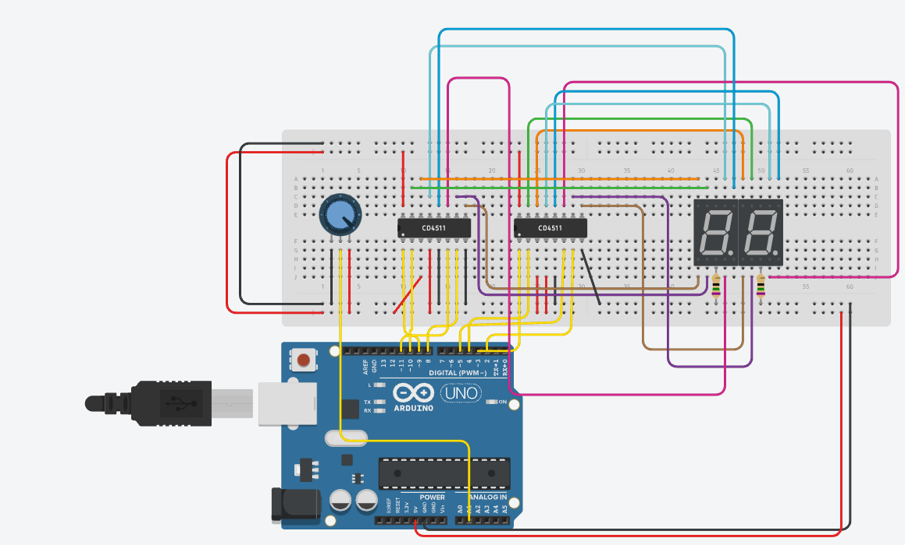

## R3 Software Task 1
 
[Link to my Circuit on TinkerCad](https://www.tinkercad.com/things/czvFiMG5kic-r3-software-task-1)

This is my completed version of the circuit. The potentiometer is wired to A1 - which is an analog input slot. The 2 CD4511 Decoders are both wired to outputs [2, 3, 4, 5] and [8. 9, 10, 11]. The Lamp Test, Blanking Test and Latch Enable were wired to High, High and Low respectively as stated in the truth table for the part. Lastly the a-g pins were wired to the a-g pins on the seven-segment display. When I tried to simulate the circuit however, the parts were shown to break so I had to add a resistor of about 75 Ohms to ensure the displays didn't break. 

Next, I started my code using Scratch but with the "blocks and text option" so I could understand more about the basic structure of the Arduino Program. Once I had done a few basic tasks using Scratch, I then switched to the text editor in C++ so I could edit the code more efficiently. There I started by accessing both decoders, then using my blocks which had mapped the potentiometer output to get individual digits using the for loop. Lastly, I updated the decoders by sending 4 inputs of binary bits, which would then be converted and displayed as a digit. Finally, I cleaned up the code and added comments to ensure that it is clean and understandable.